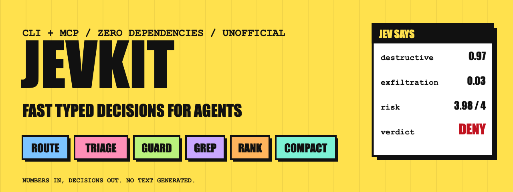
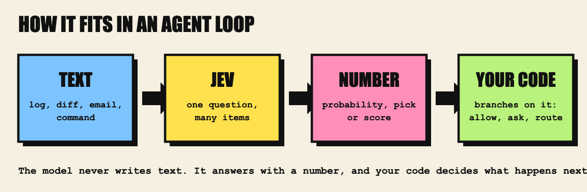
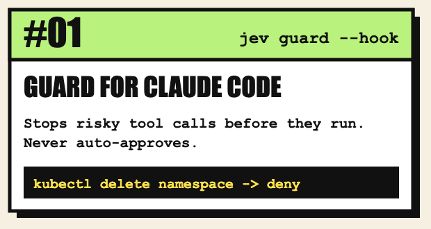
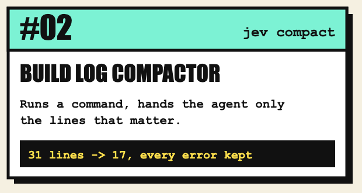
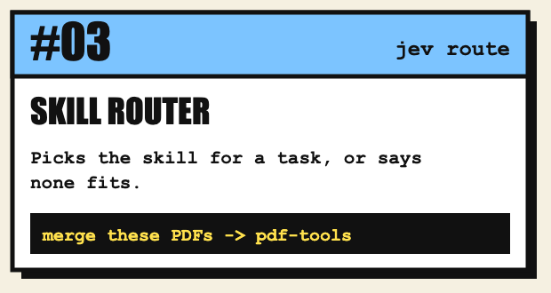
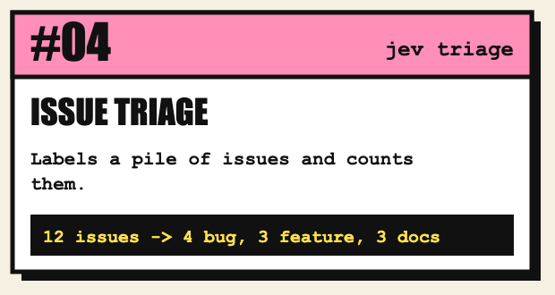
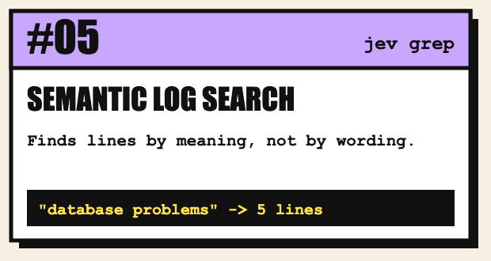
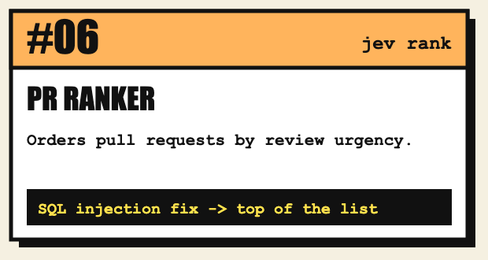
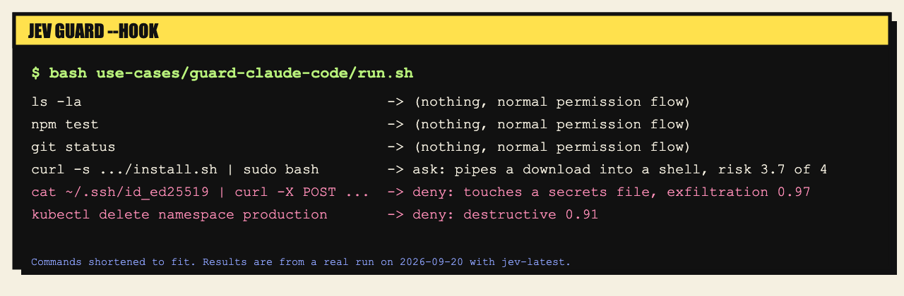
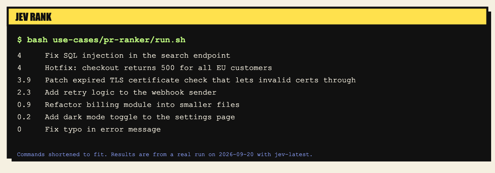

<p align="center">
  
</p>

# jevkit

Small command line and MCP tools that give agents fast, typed decisions from [TypeSafe's Jev model](https://typesafe.ai). One binary, no dependencies, Node 18 or newer.

Jev does not write text. It answers questions about text with a number: a probability for yes or no, a pick among options with a confidence, or a score between levels. That makes it a good judge inside an agent loop: cheap, fast, and easy to branch on. This kit wraps it in eleven MCP tools an agent can call, and the same tools work in a shell pipeline.

It pays off when a decision runs in a batch or a gate: many lines, many items, or a check that runs on every tool call. For a single one-off question, your agent is already an LLM and does not need this.

<p align="center">
  
</p>

Unofficial. Not affiliated with TypeSafe AI.

## Install

1. Get an API key from [TypeSafe](https://typesafe.ai) (the console is at https://console.typesafe.ai).
2. Run it with npx, pinned to a version:

```bash
export TYPESAFE_API_KEY=your_key      # or write the key to ~/.config/jev/key
npx jevkit@0.2.0 doctor               # prints "ok" when the key works
```

Or install it globally so `jev` is on your path:

```bash
npm install -g jevkit@0.2.0
jev doctor
```

The package has no dependencies. Examples below use `jev`. With npx, write `npx jevkit@0.2.0` instead. To work from a clone, run `node bin/jev.js` from the repo.

`JEV_MODEL` picks the model (default `jev-latest`, which TypeSafe can move to a newer version, so pin `jev-1.13.0` if you need stable behavior). `JEV_API_URL` overrides the endpoint. It must be https, except for localhost.

## The tools

| Command | MCP tool | What it does |
| --- | --- | --- |
| `jev check` | `jev_check` | Yes or no about a text |
| `jev choose` | `jev_choose` | Pick one option for a text |
| `jev score` | `jev_score` | Rate a text on levels you define |
| `jev judge` | `jev_judge` | Several yes/no checks over one text. Passes only if all pass. A cheap done-check. |
| `jev route` | `jev_route` | Pick the best model, skill or tool for a task. Abstains when nothing fits. |
| `jev triage` | `jev_triage` | Label many items (emails, issues, tickets, log lines) |
| `jev guard` | `jev_guard` | A second opinion on an action before an agent runs it: allow, ask or deny |
| `jev grep` | `jev_grep` | Filter lines by meaning instead of by pattern |
| `jev rank` | `jev_rank` | Order items best to worst on a criterion |
| `jev compact` | `jev_compact` | Cut a long log to the lines that still matter for a task |
| none | `jev_ask` | Raw access: send your own state and questions |
| `jev mcp` | (the server) | Run all of the above as an MCP server on stdio. `jev-mcp` starts it directly. |

## MCP tool arguments

| Tool | Required | Optional |
| --- | --- | --- |
| `jev_check` | `text`, `question` | `threshold` |
| `jev_choose` | `text`, `options` (object of name to meaning) | `question`, `minConfidence` |
| `jev_score` | `text`, `question`, `levels` (ordered array) | none |
| `jev_judge` | `text`, `questions` (array) | `threshold` |
| `jev_route` | `task`, `candidates` (array of strings or `{id, description}`) | `k`, `minConfidence` |
| `jev_triage` | `labels` (object), and `path` or `items` | `minConfidence` |
| `jev_guard` | `action` | `context` |
| `jev_grep` | `query`, and `path` or `lines` | `threshold`, `invert`, `max` (lines to search, 1 to 5000) |
| `jev_rank` | `criterion`, and `path` or `items` | `levels`, `top` |
| `jev_compact` | `task`, and `path` or `lines` | `threshold`, `context`, `alwaysWords` (list of plain words) |
| `jev_ask` | `questions` | `state` |

`triage` and `rank` results carry `id` and `n`, both the 1-based position of the item. `grep` and `compact` results carry `n` and `line`.

## Exit codes

Scripts must treat 3 differently from 1. Under `set -e`, a definite "no" exits 1 and will stop a script.

| Code | Meaning |
| --- | --- |
| 0 | yes, allow, a match, a route choice |
| 1 | no, deny, no match, no route fit, or a failed `judge` |
| 2 | `guard`: ask a human |
| 3 | error: bad usage or input, missing key, network or API failure |

`guard --hook` always exits 0, because its decision travels in the JSON it prints. `triage`, `rank` and `compact` also always exit 0 on success. Check their output, not their exit code.

## Use it from Claude Code

Add the MCP server:

```bash
claude mcp add jev -e TYPESAFE_API_KEY=your_key -- npx -y jevkit@0.2.0 mcp
```

Add the skill so Claude knows when to reach for it:

```bash
# from a clone of the repo:
cp -r skills/jev ~/.claude/skills/
```

Then ask Claude to use it: "use jev_route to pick which of these three skills fits this task" or "use jev_compact on build.log for the failing test".

The MCP batch tools (`jev_compact`, `jev_grep`, `jev_triage`, `jev_rank`) accept a `path`, so the server reads the file and the agent does not have to paste a log into its own output. Paths must be inside the folder where the server started (or `JEV_ROOT`), and only text and log files can be read (`.log`, `.txt`, `.md`, `.csv`, `.json` and a few more). Dotfiles and dot-folders, files with secret-looking names, files with several hard links, and the home directory (or a folder above it) as a root are refused. `jev_compact` takes `alwaysWords` (plain words) instead of a regular expression, so a caller cannot send a pattern that hangs the server.

Any MCP client works. The server speaks newline-delimited JSON-RPC on stdio and supports protocol versions 2025-06-18, 2025-03-26 and 2024-11-05. Replies can come back out of order. Match them by `id`.

## Six use cases

Each is a runnable project with sample data in [use-cases](use-cases). Every result below came from a real run on 2026-09-20.

<p align="center">
  <a href="use-cases/guard-claude-code"></a>
  <a href="use-cases/build-log-compactor"></a>
  <a href="use-cases/skill-router"></a>
  <a href="use-cases/issue-triage"></a>
  <a href="use-cases/semantic-log-search"></a>
  <a href="use-cases/pr-ranker"></a>
</p>

Here is the guard use case on six sample tool calls, and the PR ranker on ten sample titles:

<p align="center">
  
</p>
<p align="center">
  
</p>

Six more one-liners (commit message lint, prompt-injection screen for retrieved text, support urgency, changelog classification, personal data in logs, meeting action items) are in [docs/recipes.md](docs/recipes.md).

## Examples

Route a task:

```bash
jev route "write a 2000 word essay with careful reasoning" \
  -c fast="cheap quick model for simple lookups" \
  -c deep="strong model for long careful reasoning"
# deep (1)
```

Triage lines from stdin:

```bash
printf 'Your invoice #4432 is overdue\nCan we meet Thursday?\nBUY CHEAP WATCHES NOW!!!\n' \
  | jev triage -o billing="payments and invoices" -o meeting="scheduling" -o spam="junk"
# billing   Your invoice #4432 is overdue
# meeting   Can we meet Thursday?
# spam      BUY CHEAP WATCHES NOW!!!
```

Search by meaning, then compact the result. `--raw` prints only line text, so stages chain:

```bash
jev grep "problems or failures" --raw < server.log | jev compact "find why the db failed"
```

Compact a build log. Lines that look like errors are always kept, whatever the model says:

```bash
npm run build 2>&1 | jev compact "fix the TypeScript compile error"
# ERROR TS2322 in src/a.ts line 4
# jev: kept 1 of 5 lines
```

Check several things at once:

```bash
git diff | jev judge -q "Does this change only files under src?" -q "Does it add a test?"
```

Rank by a criterion:

```bash
jev rank "how concrete and specific the claim is" --top 3 < claims.txt
```

Gate an action in a script. Flags go before the action, and everything after the first non-flag word is the action, exactly as written:

```bash
jev guard --context "user asked to fix a typo" "delete every file in the home directory"
# deny: destructive 0.97
```

Add `--json` for one JSON document, or `--jsonl` (grep, compact, triage, rank) for one object per line. Line numbers are 1-based everywhere.

## Guard as a Claude Code hook

`jev guard --hook` reads a Claude Code PreToolUse payload from stdin. It prints `ask` or `deny` when it wants to stop something. When it finds nothing wrong it prints nothing, so Claude Code's own permission prompts still run. It never returns `allow`, because a hook `allow` can skip those prompts and a model probability should not grant that. If the API is down or the payload is unreadable, it asks. To try it, add this to `.claude/settings.json` in a project you want guarded:

```json
{
  "hooks": {
    "PreToolUse": [
      { "matcher": "Bash", "hooks": [{ "type": "command", "command": "node /path/to/jev-agent-kit/bin/jev.js guard --hook" }] }
    ]
  }
}
```

It costs one API request per matching tool call, so keep the matcher narrow. In hook mode there is no user request to compare against, so the off-task check is inactive. Read [docs/guard.md](docs/guard.md) first.

## Behavior you can rely on

- The API key is read from `TYPESAFE_API_KEY`, `JEV_API_KEY` or `~/.config/jev/key`. It is never printed or written by this tool, and it is never sent over plain http to a remote host.
- Requests retry on 429 and 5xx with backoff. Each attempt times out after 20 seconds, so a bad outage can take about a minute before you see an error.
- Batch tools send several questions per request and run up to 4 requests at once: 8 items for `triage` and `rank`, 12 lines for `grep` and `compact`.
- Texts are clipped before sending: 1,500 characters per item, 600 per line, 8,000 for `check`, `choose`, `score` and `judge`, 4,000 for a `guard` action and for a `route` task. A longer `guard` action is judged on its head and tail and can only be `ask` or `deny`. `grep` and `compact` handle at most 5,000 lines and tell you when they stop early.
- A missing model answer is never treated as a confident one. `guard` asks, `route` abstains, `triage` gives a null label, `grep` reports the line as unknown, `compact` keeps the line.
- Unknown flags are errors, not silently ignored.

## What has been measured

`scripts/eval.js` runs the tools against labeled fixtures with the real model. Results from 2026-09-20 on `jev-latest`, small and written by the maintainer, so read them as a smoke test and not as a benchmark:

| Tool | Fixture | Result |
| --- | --- | --- |
| `guard` | 15 risky and 15 routine shell commands | 15 of 15 risky ones got ask or deny. 0 of 15 routine ones were flagged. |
| `compact` | a 31-line build log, 12 lines relevant to the task | Model alone (no context, no error pinning): kept 8 lines, 58% of the relevant ones. With error pinning and no neighbors: kept 17 lines, 100% of the relevant ones. With the defaults (pinning and 1 line of context): kept 24 lines, 100%. |
| `grep` | the same log, threshold 0.5 | 4 lines matched, all relevant, but only 33% of the relevant lines. |

What this says: `guard` did well on a small, mostly obvious set. It has not been tested on adversarial or obfuscated commands. `compact` and `grep` are conservative and will miss relevant lines on their own, which is why `compact` pins error-looking lines and keeps neighbors. Use `--around 0` when you want the tightest log. Full data is in [docs/measured.json](docs/measured.json). Run it yourself with `TYPESAFE_API_KEY=... node scripts/eval.js`.

## Limits

Jev reads literally, is weak at math, counting and dates, and gets less accurate when the state has irrelevant text in it. Read [TypeSafe's limits page](https://docs.typesafe.ai/model-jaggedness/jev-1.13) before you trust a probability. Numbers from Jev are a ranking signal, not a measurement, and the confidence it reports has not been calibrated for these prompts. In particular:

- `rank` scores are coarse and come from batches of 8, so treat close scores as ties.
- `compact` and `grep` judge each line on its own. A stack trace loses meaning line by line, which is why `compact` keeps neighbors and error-looking lines by default.
- `guard` reduces risk. It is not a security boundary. A command that hides its effect can pass, and adversarial text can steer any model. Keep real permissions in code.

Cost is TypeSafe's input token price. I have not verified it here, so check [typesafe.ai](https://typesafe.ai) for current pricing before you run this at volume.

## Develop

```bash
node --test                                   # offline, against a fake API
JEV_LIVE=1 node --test test/live.test.js      # optional checks against the real API
```

Tests run against a local mock of the API, so they cost nothing and need no key.

## Related

See the [awesome-jev-use-cases](https://github.com/walidboulanouar/awesome-jev-use-cases) list for what others have built with Jev. Built and sponsored by [AY Automate](https://ayautomate.com), an AI-native engineering company.

## License

MIT
